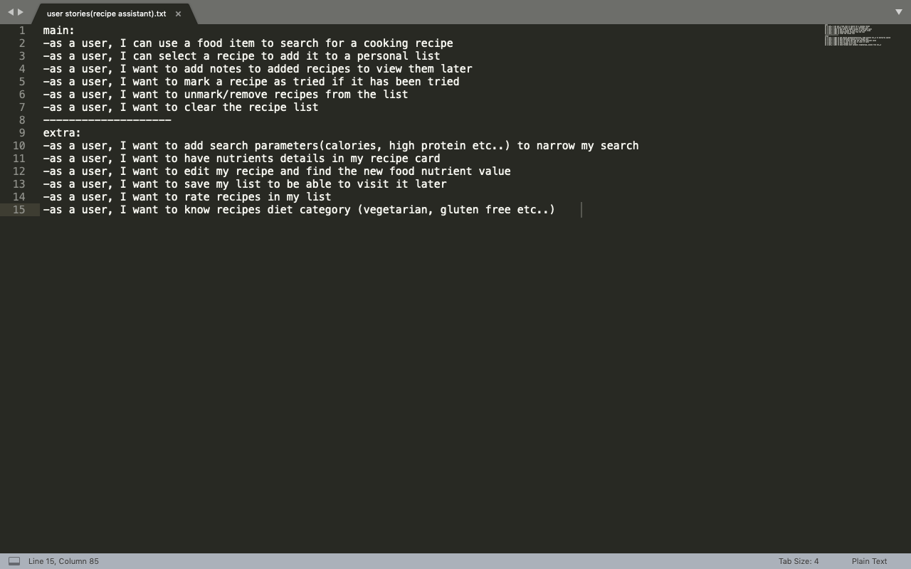
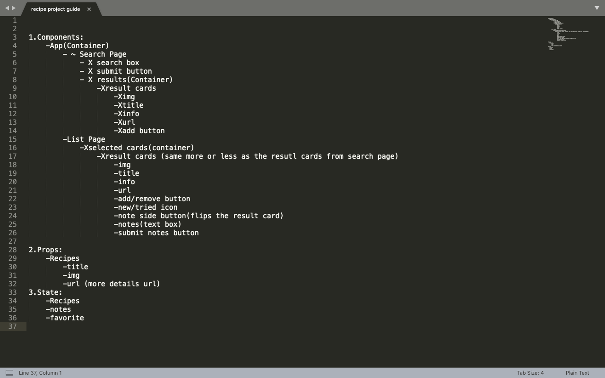
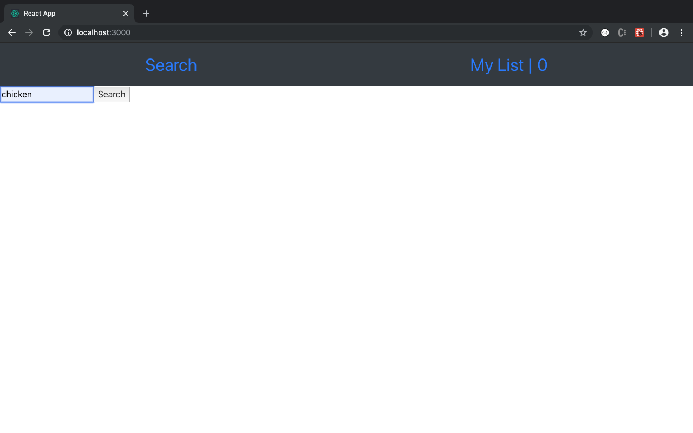
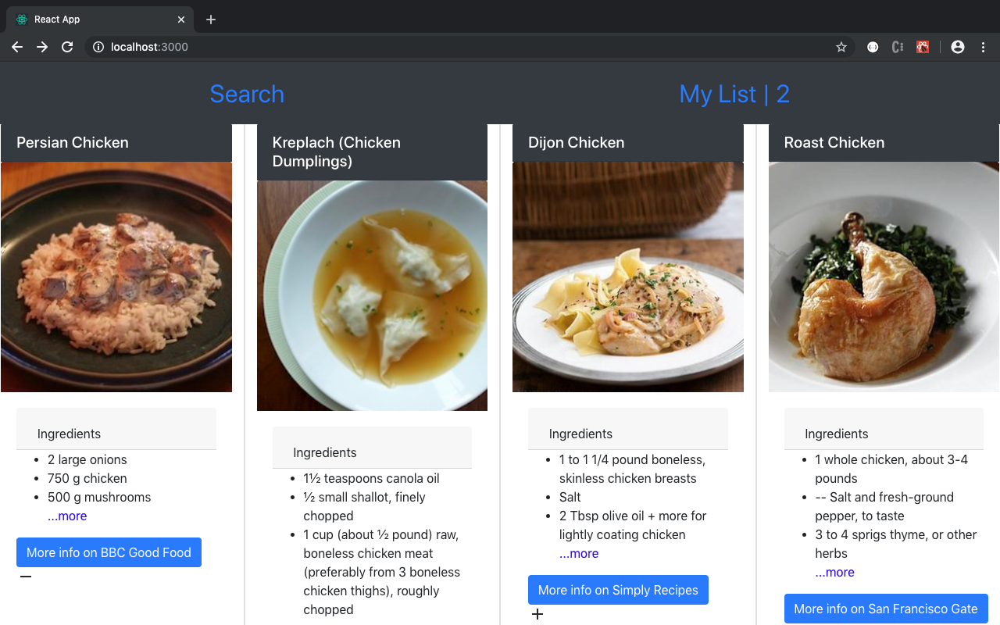
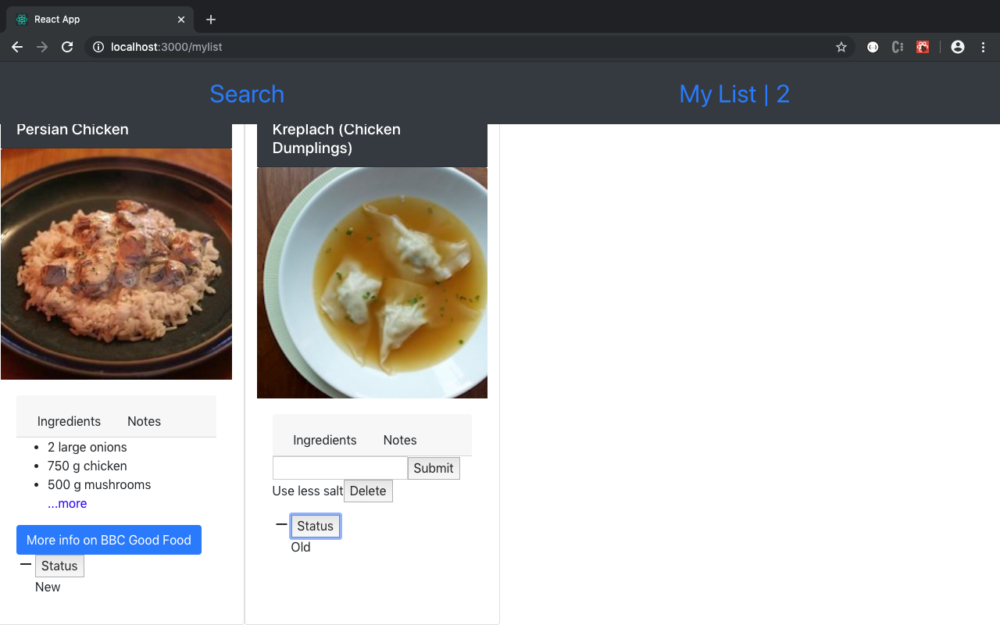
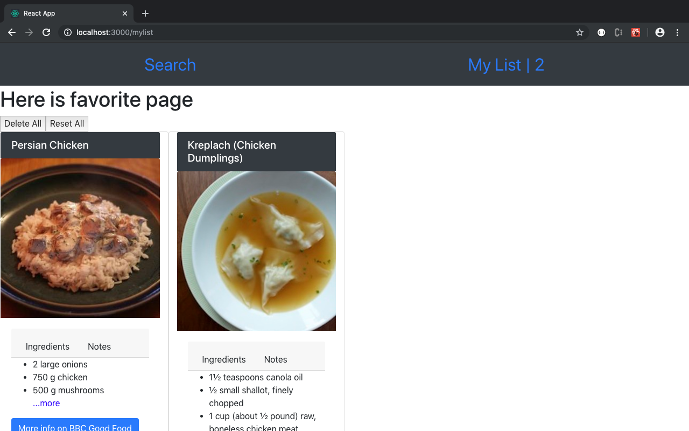

# [Recipes (APP)]( https://almarrim.github.io/recipes/):
Recipes is an app that generates cooking recipes based on a food item searched by the user. Recipes can be added to a list, marked as new/old and notes can be added to recipe cards in the list. You can visit the app [here](https://almarrim.github.io/recipes/)

## Technologies Used:
- HTML
- CSS
- JavaScript
- [Reactjs](https://reactjs.org)
- [Bootstrap](https://getbootstrap.com)
- [Material Icons](https://material.io/resources/icons/?style=baseline)
- [npm](https://www.npmjs.com)
- Text Editer
- Web browser

## Planning:
1. [User Stories](./docs/userStories.txt):

2. Wireframes:
    - 
    - 
3. [Components-Flow](./docs/componentsFlow)

## Implementation:
`create-react-app` was used to set the skeleton of our project. Then based on the [Components-Flow](./docs/componentsFlow) document, The project's components were built one by one. I was able to effeciently use all the compoents of the search page in the list page, while making components show addtional child-components when in the list page.

## Future Iterations:
[User Stories](./docs/userStories.txt) clearly show main and extra stories. All the main stories has been accomplished. The extra user stories would be a plan for future iteration of the project.

## How it works:
1. Search for a desired food item in the search box:

2. Select a recipe from the results. Each recipe would have ingredients, an add button, and an external link for more details and how to make it.

3. In the List page, you can add notes, mark as a new or an old recipe you want to save, or delete unwanted recipe.

4. You can delete or reset all cards to new in the list page.

## Author:
Mohammed Almarri

